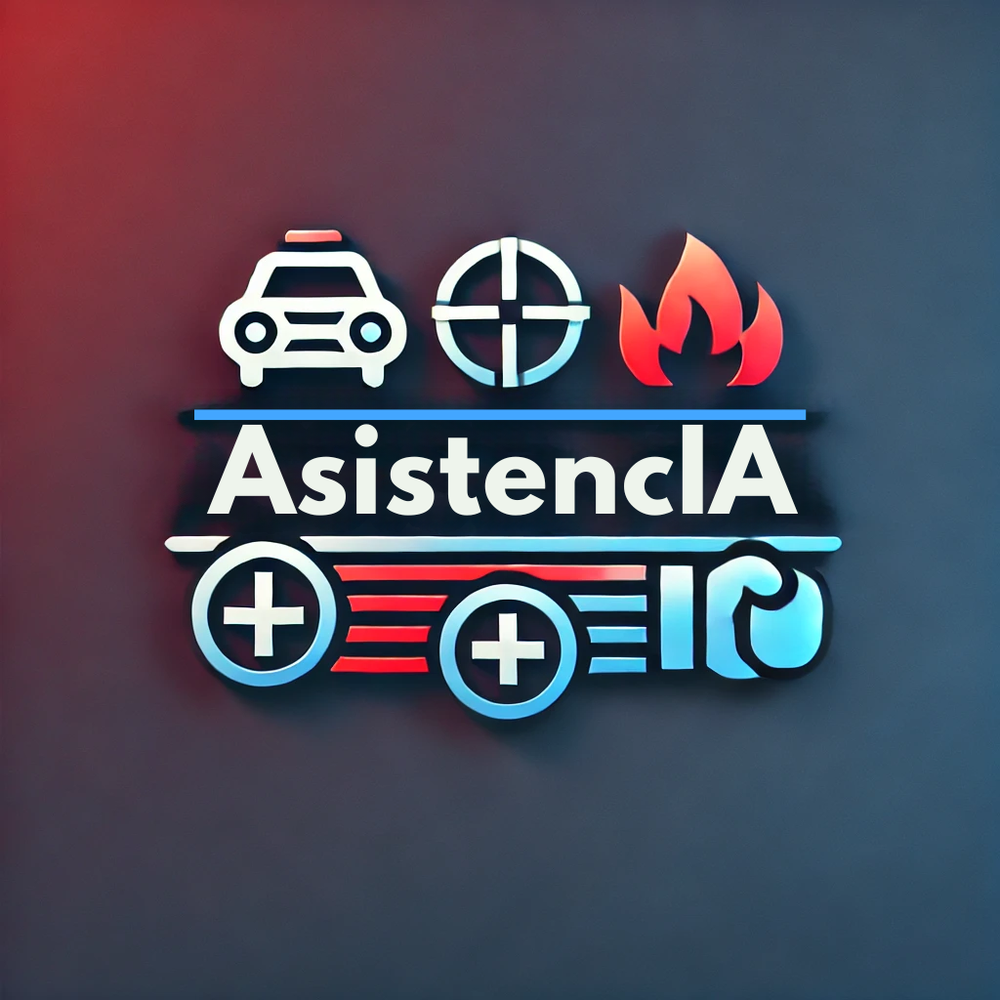

# 🏷️ Índice
1. [🔎 Justificación y descripción del proyecto](#1-justificación-y-descripción-del-proyecto)  
2. [🗂️ Obtención de datos](#2-obtención-de-datos)  
3. [📊 Descripción de los datos](#3-descripción-de-los-datos)  
4. [📈 Exploración y visualización de los datos](#4-exploración-y-visualización-de-los-datos)  
5. [🔧 Preparación de los datos para los algoritmos de Machine Learning](#5-preparación-de-los-datos-para-los-algoritmos-de-machine-learning)  
6. [🏋️ Entrenamiento del modelo y comprobación del rendimiento](#6-entrenamiento-del-modelo-y-comprobación-del-rendimiento)  
7. [🗣️ Se tiene que incluir alguna de las técnicas estudiadas en el tema de Procesamiento de Lenguaje Natural](#7-se-tiene-que-incluir-alguna-de-las-técnicas-estudiadas-en-el-tema-de-procesamiento-de-lenguaje-natural)  
8. [🌐 Aplicación web](#8-aplicación-web)  
9. [💡 Conclusiones](#9-conclusiones)

---

## 1. Justificación y descripción del proyecto
_AsistencIA_ es un proyecto de Inteligencia Artificial y Big Data orientado a la detección temprana de tres tipos de emergencias mediante análisis de video: accidentes de coche, incendios y peleas. La idea principal es utilizar cámaras de la vía pública para alertar de forma inmediata a servicios de emergencia (bomberos, ambulancias y policía) y, a la vez, ofrecer herramientas de capacitación ciudadana y asistencia en tiempo real.

### 👥 Integrantes del equipo

|  |  |
|:---------------------------------------------------------------------------------------------------------:|:-------------------------------------------------------------------------------------------------:|
| **Germán García Estévez**                                                                                 | **David Moreno Cerezo**                                                                           |

---

El proyecto _AsistencIA_ tiene como objetivo desarrollar un sistema integral que detecte, mediante análisis de video, situaciones críticas en tiempo real. Las principales emergencias a detectar son:

- **Accidentes de coche**  
- **Incendios**  
- **Peleas**

Además, se incorporan funcionalidades adicionales para mejorar la respuesta y formación de los ciudadanos ante situaciones de emergencia:

- **Módulo de Capacitación:** Permite subir enlaces a videos (por ejemplo, de YouTube) relacionados con primeros auxilios, para los cuales se genera un resumen y un cuestionario interactivo, facilitando el aprendizaje y la capacitación.
- **Chatbot Asistencial:** Un asistente conversacional que responde preguntas sobre cómo actuar en situaciones de emergencia, ofreciendo instrucciones claras y, de ser necesario, generando imágenes ilustrativas para reforzar la explicación.

---

## 2. Obtención de datos

### ACCIDENTES DE COCHE:

### PELEAS:

### INCENDIOS:

---

## 3. Descripción de los datos
Se debe dar una descripción completa de los datos indicando qué significa cada uno de los atributos.

### ACCIDENTES DE COCHE:

### PELEAS:

### INCENDIOS:

---

## 4. Exploración y visualización de los datos
### ACCIDENTES DE COCHE:
Algunos ejemplos de videos de accidentes:

Algunos ejemplos de situaciones normales:

### PELEAS:
Algunos ejemplos de videos de peleas:

Algunos ejemplos de situaciones normales:

### INCENDIOS:

---

## 5. Preparación de los datos para los algoritmos de Machine Learning
### ACCIDENTES DE COCHE Y PELEAS:

### INCENDIOS:

---

## 6. Entrenamiento del modelo y comprobación del rendimiento
### ACCIDENTES DE COCHE Y PELEAS:

### INCENDIOS:

---

## 7. Se tiene que incluir alguna de las técnicas estudiadas en el tema de Procesamiento de Lenguaje Natural

---

## 8. Aplicación web
La aplicación web se desarrollará utilizando **Streamlit** y contará con tres módulos principales:

1. **Detección en Tiempo Real:**  
   - Interfaz para uso de la webcam y subida de videos para análisis en tiempo real.
2. **Capacitación Ciudadana:**  
   - Subida de enlaces o videos para generar resúmenes y cuestionarios.
3. **Chatbot Asistencial:**  
   - Asistente conversacional que ofrece recomendaciones y guía en situaciones de emergencia.
---

## 9. Conclusiones
