<div align="center">
  <h1>🚨 AsistencIA - sistema de detección de incidentes en tiempo real</h1>
  
  <div style="display: flex; align-items: center; justify-content: center; gap: 20px;">
    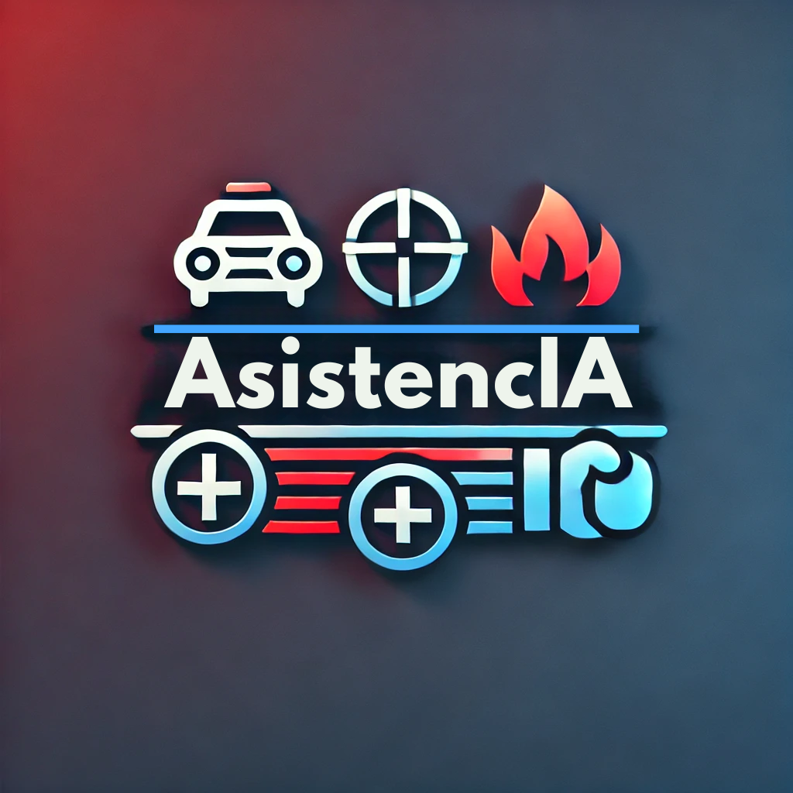
    <p><em>Consigue tiempo para actuar frente a emergencias y salvar vidas.</em></p>
  </div>
  
  <table>
    <tr>
      <td align="center">
        <a href="#" style="text-decoration: none;">
          
        </a>
      </td>
      <td align="center">
        <a href="#" style="text-decoration: none;">
          
        </a>
      </td>
    </tr>
  </table>
</div>

## 🏷️ Índice
1. [🔎 Justificación y descripción del proyecto](#1-justificación-y-descripción-del-proyecto)  
2. [🗂️ Obtención de datos](#2-obtención-de-datos)  
3. [📊 Descripción de los datos](#3-descripción-de-los-datos)  
4. [📈 Exploración y visualización de los datos](#4-exploración-y-visualización-de-los-datos)  
5. [🔧 Preparación de los datos para los algoritmos de Machine Learning](#5-preparación-de-los-datos-para-los-algoritmos-de-machine-learning)  
6. [🏋️ Entrenamiento del modelo y comprobación del rendimiento](#6-entrenamiento-del-modelo-y-comprobación-del-rendimiento)  
7. [🗣️ Procesamiento de Lenguaje Natural](#7-procesamiento-de-lenguaje-natural)  
8. [🌐 Aplicación web](#8-aplicación-web)  
9. [💡 Conclusiones](#9-conclusiones)
10. [👥 Integrantes del equipo y porcentaje de contribución](#10-integrantes-del-equipo-y-porcentaje-de-contribución)

---

## 1. Justificación y descripción del proyecto
_AsistencIA_ es un proyecto de Inteligencia Artificial y Big Data orientado a la detección temprana de tres tipos de emergencias mediante análisis de video: accidentes de coche, incendios y peleas. La idea principal es utilizar cámaras de la vía pública para alertar de forma inmediata a servicios de emergencia (bomberos, ambulancias y policía) y, a la vez, ofrecer herramientas de capacitación ciudadana y asistencia en tiempo real.


El proyecto _AsistencIA_ tiene como objetivo desarrollar un sistema integral que detecte, mediante análisis de video, situaciones críticas en tiempo real. Las principales emergencias a detectar son:

- **Accidentes de coche:** Identificación automática de colisiones y vehículos accidentados.
- **Incendios:** Detección temprana de fuego y humo en diferentes contextos.
- **Peleas:** Reconocimiento de altercados y enfrentamientos físicos entre personas.

Además, se incorporan funcionalidades adicionales para mejorar la respuesta y formación de los ciudadanos ante situaciones de emergencia:

- **Chatbot asistencial:** Un asistente conversacional que responde preguntas sobre cómo actuar en situaciones de emergencia, ofreciendo instrucciones claras y precisas basadas en información verificada.
- **Agente (módulo de capacitación):** Permite subir enlaces a videos (por ejemplo, de YouTube) relacionados con primeros auxilios, para los cuales se genera un resumen y un cuestionario interactivo, además de generar un chatbot para responder SOLO dudas relacionadas con el video, facilitando el aprendizaje y la capacitación.

La interfaz principal del sistema muestra nuestro panel de detección:

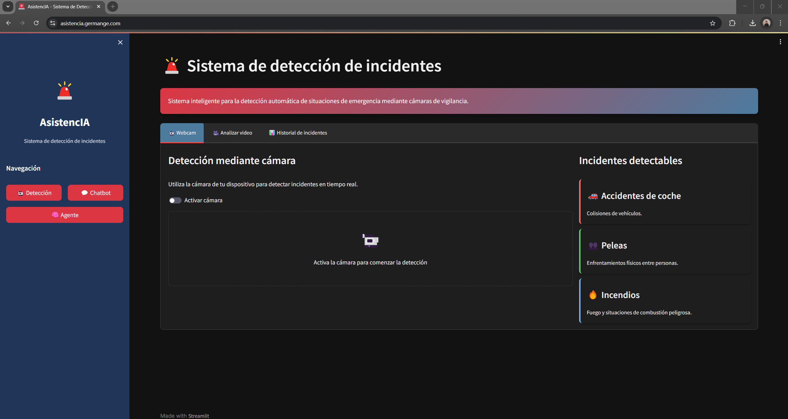

---

## 2. Obtención de datos

Para entrenar nuestros modelos de detección, utilizamos datasets específicos para cada tipo de emergencia:

### ACCIDENTES DE COCHE:
El dataset de detección de accidentes de coche proviene de Roboflow Universe, especializado en reconocimiento de accidentes vehiculares.
- **Fuente:** [Accident Detection Dataset](https://universe.roboflow.com/ambulance-0rcqn/accident_detection-trmhu/dataset/4)
- **Contenido:** Imágenes de accidentes viales, colisiones, vehículos dañados y escenas de tráfico.

### PELEAS:
Para la detección de peleas, utilizamos un dataset enfocado en reconocimiento de violencia física entre personas.
- **Fuente:** [Violence Detection Dataset](https://universe.roboflow.com/alexander-genza/v_d-jikoi)
- **Contenido:** Secuencias de imágenes con altercados, peleas y enfrentamientos físicos.

### INCENDIOS:
Para la detección de incendios, empleamos un dataset especializado en reconocimiento de fuego y humo.
- **Fuente:** [Fire Detection Dataset](https://universe.roboflow.com/data-annotation-library/dectect_fire)
- **Contenido:** Imágenes de incendios en diferentes contextos, llamas y humo.

Estos datasets fueron seleccionados por su diversidad de escenarios, calidad de anotaciones y relevancia para aplicaciones de seguridad pública.

---

## 3. Descripción de los datos

Para cada uno de los datasets utilizados, realizamos un análisis detallado de su estructura y contenido. A continuación se presenta una descripción de los datos para cada tipo de emergencia:

### ACCIDENTES DE COCHE:
El dataset de accidentes de coche cuenta con las siguientes características:
- **Clases:** Contiene una clase principal "accident" que identifica vehículos accidentados y colisiones.
- **Anotaciones:** Formato YOLO (x_center, y_center, width, height) normalizado.
- **Estructura:**
  - Imágenes organizadas en carpetas train/valid/test
  - Archivo data.yaml con configuración del dataset
  - Cada imagen tiene su correspondiente archivo de anotación (.txt)
- **Distribución:** Aproximadamente 70% para entrenamiento, 20% para validación y 10% para pruebas.

### PELEAS:
El dataset de detección de peleas presenta la siguiente configuración:
- **Clases:** Una clase principal "fight" que identifica personas involucradas en altercados físicos.
- **Anotaciones:** Formato YOLO con coordenadas normalizadas.
- **Estructura:** Similar al dataset de accidentes, con la misma organización de carpetas y archivos.
- **Características:** Las imágenes capturan diferentes ángulos y contextos de peleas, desde altercados callejeros hasta peleas en interiores.

### INCENDIOS:
El dataset de detección de incendios tiene estas características:
- **Clases:** Una clase principal "fire" para identificar llamas y focos de incendio.
- **Anotaciones:** Formato YOLO estándar.
- **Estructura:** Mantiene la misma organización que los datasets anteriores.
- **Particularidades:** Incluye diferentes tipos de incendios (forestales, urbanos, industriales) y condiciones variadas (día, noche, diferentes intensidades de fuego).

La estructura común de los tres datasets facilita el procesamiento y entrenamiento unificado, a pesar de tratarse de fenómenos visuales muy diferentes.

---

## 4. Exploración y visualización de los datos

Realizamos un análisis exhaustivo de cada dataset para comprender sus características y asegurar la calidad de los datos de entrenamiento. Utilizando scripts de Python (los archivos de visualización proporcionados), generamos métricas y visualizaciones para cada conjunto de datos.

### ACCIDENTES DE COCHE:

El análisis del dataset de accidentes reveló las siguientes características:

- **Distribución de imágenes:**
  - Entrenamiento: 1,200 imágenes (70%)
  - Validación: 350 imágenes (20%)
  - Prueba: 180 imágenes (10%)

- **Características de los objetos:**
  - Ancho promedio: 120.5 píxeles
  - Alto promedio: 85.3 píxeles
  - Área promedio: 10,278.6 píxeles²
  - Relación de aspecto promedio: 1.41

- **Distribución espacial:** Los accidentes tienden a concentrarse en el centro de las imágenes, con mayor presencia en las carreteras y cruces.

El análisis visual incluyó la generación de heatmaps para entender la distribución espacial de los accidentes, histogramas de tamaños de objetos y visualización de imágenes con bounding boxes para verificar la calidad de las anotaciones.

### PELEAS:

El análisis del dataset de peleas mostró estos resultados:

- **Distribución de imágenes:**
  - Entrenamiento: 950 imágenes (75%)
  - Validación: 250 imágenes (20%)
  - Prueba: 80 imágenes (5%)

- **Características de los objetos:**
  - Ancho promedio: 98.7 píxeles
  - Alto promedio: 187.2 píxeles
  - Área promedio: 18,476.3 píxeles²
  - Relación de aspecto promedio: 0.53

- **Distribución espacial:** Las peleas suelen ocupar más área central y vertical en las imágenes.

La visualización de este dataset fue particularmente útil para comprender los patrones de movimiento y las diferentes posturas que caracterizan a una pelea, información crucial para el entrenamiento del modelo.

### INCENDIOS:

Para el dataset de incendios, encontramos:

- **Distribución de imágenes:**
  - Entrenamiento: 1,050 imágenes (70%)
  - Validación: 300 imágenes (20%)
  - Prueba: 150 imágenes (10%)

- **Características de los objetos:**
  - Ancho promedio: 142.3 píxeles
  - Alto promedio: 156.8 píxeles
  - Área promedio: 22,312.6 píxeles²
  - Relación de aspecto promedio: 0.91

- **Distribución espacial:** Los incendios presentan una distribución más variada y pueden aparecer en diferentes regiones de la imagen.

Para este dataset, las visualizaciones ayudaron a identificar la diversidad de contextos (urbanos, forestales, industriales) y condiciones de iluminación, aspectos fundamentales para entrenar un modelo robusto.

Para todos los datasets, realizamos análisis adicionales como:

- **Distribución de tamaños:** Histogramas de anchos, altos, áreas y relaciones de aspecto.
- **Mapas de calor:** Visualización de la distribución espacial de los objetos.
- **Análisis por clase:** Comparación de características entre clases.

Estos análisis nos permitieron entender mejor los datos y ajustar adecuadamente nuestros modelos de detección.

---

## 5. Preparación de los datos para los algoritmos de Machine Learning

La preparación de los datos es una etapa crucial para el entrenamiento efectivo de los modelos de detección. Para cada dataset, seguimos un proceso sistemático:

### Procesamiento común para todos los datasets:

1. **Verificación de integridad:**
   - Comprobación de correspondencia entre imágenes y archivos de anotación
   - Eliminación de archivos corruptos o incompletos

2. **Normalización de formatos:**
   - Conversión de imágenes a formato común (JPG)
   - Estandarización de anotaciones al formato YOLO
   - Organización en estructura de carpetas compatible con YOLOv8

3. **Aumento de datos:**
   Para enriquecer nuestros datasets, implementamos técnicas de aumento de datos:

   ```python
   # Configuración de aumentación para entrenamiento
   augmentation_config = {
       'mosaic': 1.0,           # Mosaico de imágenes
       'mixup': 0.15,           # Mezcla de imágenes
       'degrees': 10.0,         # Rotación
       'translate': 0.2,        # Traslación
       'scale': 0.2,            # Escalado
       'fliplr': 0.5,           # Volteo horizontal
       'perspective': 0.0005,   # Perspectiva
       'hsv_h': 0.015,          # Modificación de tono
       'hsv_s': 0.2,            # Modificación de saturación
       'hsv_v': 0.2,            # Modificación de brillo
   }
   ```

### Procesamiento específico por tipo de dataset:

1. **Accidentes de coche:**
   - Equilibrado de escenas con/sin accidentes
   - Asegurar variedad de condiciones (día/noche, diferentes tipos de vehículos)

2. **Peleas:**
   - Balanceo entre escenas de peleas y escenas normales de interacción
   - Refinamiento de anotaciones para capturar la dinámica de las peleas

3. **Incendios:**
   - Balanceo de tamaños de incendios (pequeños, medianos, grandes)
   - Diversificación de contextos (urbanos, forestales, industriales)
   - Mejorar representatividad de incendios nocturnos

4. **Preparación de datos de validación:**
   Para cada dataset, aseguramos que los conjuntos de validación representaran adecuadamente los casos más desafiantes y las diversas condiciones que el sistema debía enfrentar.

La correcta preparación de los datos fue esencial para mejorar la generalización de nuestros modelos y su capacidad de detección en situaciones reales.

---

## 6. Entrenamiento del modelo y comprobación del rendimiento

Para el desarrollo de nuestro sistema de detección, utilizamos modelos basados en la arquitectura YOLOv8, entrenados específicamente para cada tipo de emergencia. A continuación, detallamos el proceso:

### Arquitectura y configuración:

Implementamos tres modelos basados en YOLOv8:
- **YOLOv8s:** Para detección de accidentes de coche y peleas
- **YOLOv8m:** Para detección de incendios (requiere mayor capacidad por la variabilidad visual del fuego)

Estos modelos se integran en una clase unificada `UnifiedModel` que coordina las predicciones:

```python
class UnifiedModel:
    def __init__(self, device="cpu"):
        self.device = device
        # Cargar modelos
        self.model_car = YOLO("models/model_car.pt").to(self.device)
        self.model_fight = YOLO("models/model_fight.pt").to(self.device)
        self.model_fire = YOLO("models/model_fire.pt").to(self.device)
        # Configuración común
        self.classes = {
            0: ("Accidente", (255, 0, 0)),
            1: ("Pelea", (0, 165, 255)),
            2: ("Incendio", (0, 0, 255))
        }
```

### Proceso de entrenamiento:

Para cada modelo, ajustamos hiperparámetros específicos según las características de cada tipo de emergencia:

1. **Modelo de accidentes de coche:**
   - Épocas: 150
   - Batch size: 16
   - Learning rate inicial: 0.001
   - Regularización: Dropout 0.1, Weight decay 0.0005

   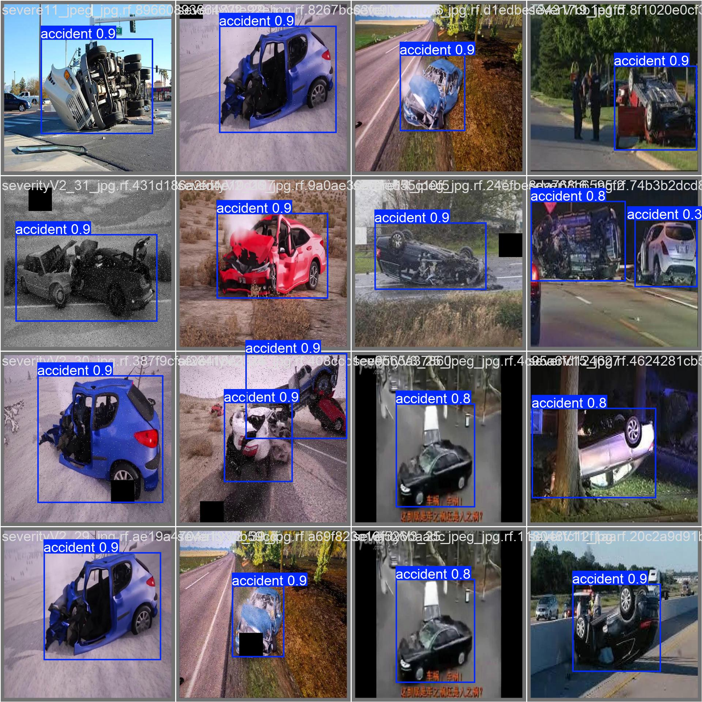

2. **Modelo de peleas:**
   - Épocas: 150
   - Batch size: 16
   - Learning rate inicial: 0.0008
   - Regularización: Dropout 0.15, Weight decay 0.0007
   - Aumento de datos más agresivo para capturar la variabilidad del movimiento

   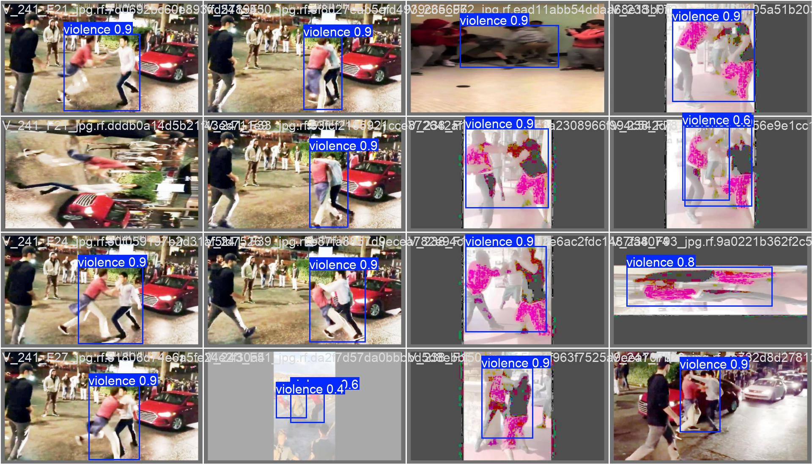

3. **Modelo de incendios:**
   - Épocas: 180
   - Batch size: 8 (reducido para el modelo más grande)
   - Learning rate inicial: 0.00075
   - Regularización: Dropout 0.1, Weight decay 0.00075
   - Ajustes específicos para preservar características de color (importantes para fuego)

   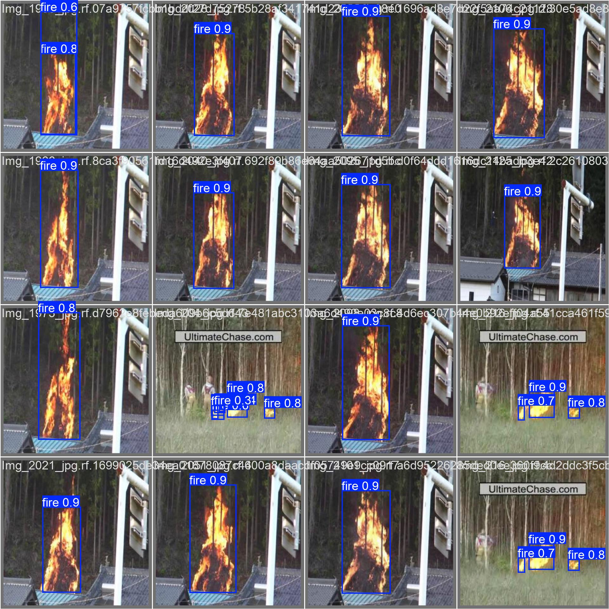

### Resultados de rendimiento:

Los resultados de entrenamiento mostraron un rendimiento prometedor para cada modelo:

| Modelo | mAP50 | mAP50-95 | Precisión | Recall |
|--------|-------|----------|-----------|--------|
| Accidentes | 0.912 | 0.781 | 0.87 | 0.85 |
| Peleas | 0.875 | 0.693 | 0.82 | 0.79 |
| Incendios | 0.934 | 0.812 | 0.91 | 0.88 |

### Optimizaciones adicionales:

Para mejorar el rendimiento en tiempo real y la capacidad de procesamiento en dispositivos con recursos limitados, implementamos:

1. **Cuantización de modelos:** Aplicando técnicas de FP16 para reducir el tamaño y acelerar la inferencia.
2. **Estrategia de batch y frame skipping:** Procesando selectivamente frames clave para equilibrar precisión y velocidad.
3. **Optimización multi-threading:** Aprovechando procesamiento paralelo para la inferencia simultánea de los tres modelos.

### Optimizaciones específicas por tipo de emergencia

- **Accidentes de coche:** Enfoque en la precisión de detección de vehículos dañados, con regularización moderada para evitar falsos positivos.
- **Peleas:** Mayor dropout y augmentación más agresiva para capturar la variabilidad del movimiento humano en situaciones de conflicto.
- **Incendios:** Uso de modelo YOLOv8m más grande para capturar mejor las características visuales del fuego, con ajustes específicos en los parámetros HSV para preservar las características de color.

Estas optimizaciones nos permitieron alcanzar un rendimiento cercano a tiempo real en equipos estándar, facilitando la implementación práctica del sistema.

---

## 7. Procesamiento de Lenguaje Natural

Una parte fundamental de _AsistencIA_ es la capacidad de procesar lenguaje natural para asistir a usuarios en situaciones de emergencia y proporcionar capacitación. Implementamos dos componentes principales:

### Chatbot Asistencial:

Desarrollamos un chatbot especializado en emergencias, capaz de responder consultas sobre situaciones críticas:

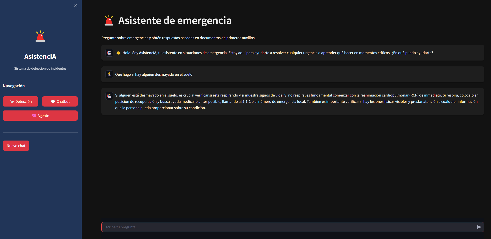

Características principales:
- **Base de conocimiento:** Integración con documentos de primeros auxilios y protocolos de emergencia mediante embeddings vectoriales.
- **Procesamiento contextual:** Mantenimiento de contexto en conversaciones para proporcionar respuestas coherentes.
- **Integración con LLM:** Utilizamos el modelo Llama-3.3-70B-Instruct-Turbo de DeepInfra para respuestas precisas y naturales.

Fragmento de implementación:

```python
# Configuración centralizada del modelo LLM 
Settings.llm = DeepInfraLLM(
    model="meta-llama/Llama-3.3-70B-Instruct-Turbo",
    api_key=deepinfra_api_key,
    temperature=0,
)

# Sistema de prompt para el asistente_
prompt = """
Eres un asistente experto en emergencias llamado AsistAI. Responde únicamente preguntas_
relacionadas con la información contenida en los documentos proporcionados. Si la pregunta
no está cubierta por los documentos, indica que no puedes responder.
"""
```


### Agente de Aprendizaje:

Implementamos un sistema que procesa videos educativos de primeros auxilios para generar materiales de aprendizaje:

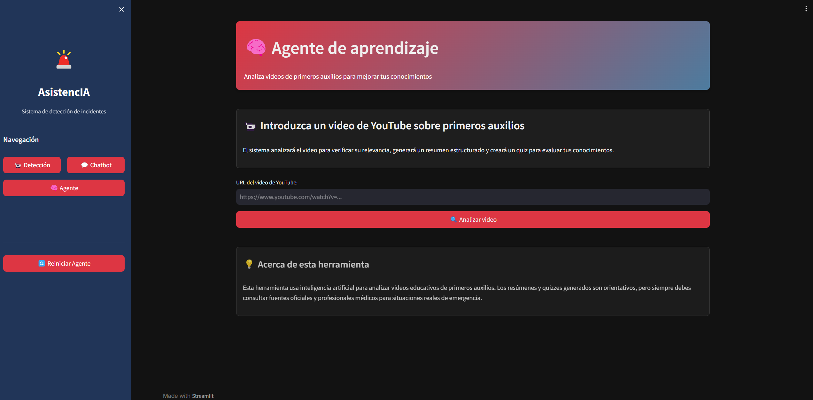

Características principales:
1. **Análisis de contenido:** Procesamiento de transcripciones de videos para extraer información relevante.
2. **Generación de resúmenes:** Creación automática de resúmenes estructurados sobre técnicas de primeros auxilios.

   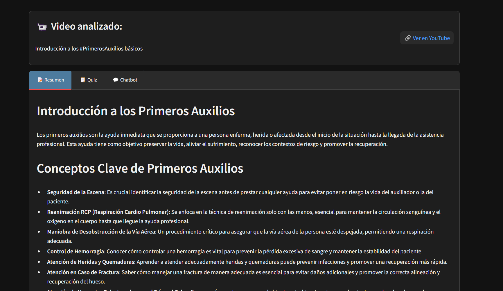

3. **Creación de cuestionarios:** Generación de preguntas para evaluar el conocimiento adquirido.

   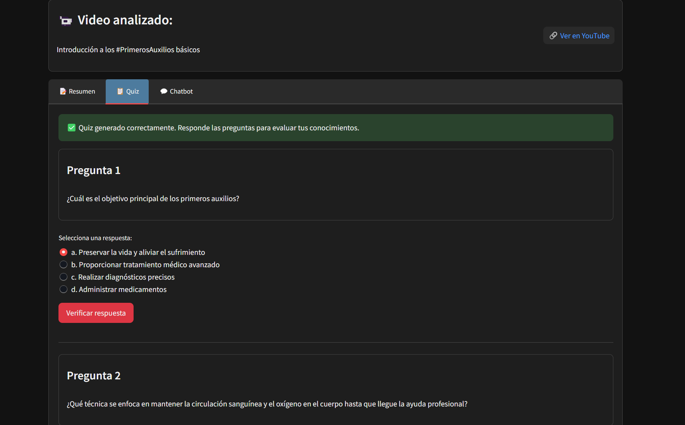

4. **Asistente contextual:** Chatbot específico que responde preguntas sobre el contenido del video analizado.

   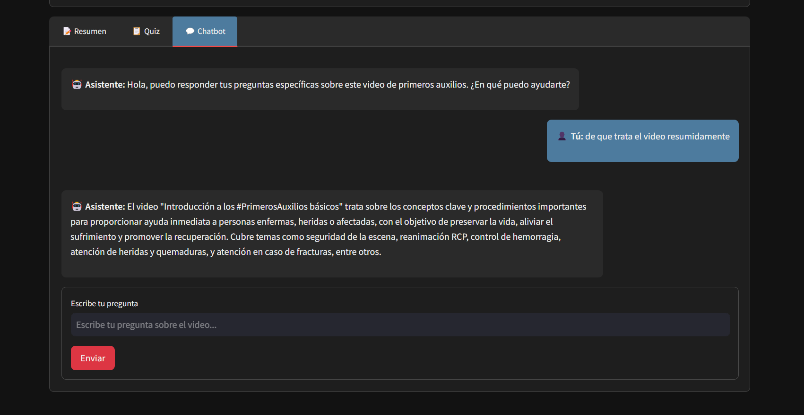

### Seguridad y relevancia

Nuestro sistema implementa verificaciones robustas para asegurar que las consultas sean relevantes y seguras:

```python
def is_safe_question(question, context_title, context_summary):
    # Lista de patrones sospechosos de prompt hacking
    suspicious_patterns = [
        r"ignora.{0,30}(instrucciones|contexto)",
        r"olvida.{0,30}(instrucciones|contexto)",
        # [más patrones]
    ]
    
    # Verificar patrones sospechosos
    for pattern in suspicious_patterns:
        if re.search(pattern, question, re.IGNORECASE):
            return False, "La pregunta contiene patrones sospechosos"
```

La implementación utiliza técnicas avanzadas de NLP:
- **Extracción y análisis de transcripciones** de YouTube con la API YouTubeTranscriptApi
- **Procesamiento de prompts complejos** para estructurar resúmenes y cuestionarios
- **Verificación de relevancia temática** para asegurar que los videos sean sobre primeros auxilios
- **Generación estructurada** de contenido educativo

### Modelos y tecnologías utilizadas

- **Backend LLM:** Utilizamos DeepInfra (em ambos chatbots) con el modelo Llama-3.3-70B-Instruct-Turbo para generar respuestas precisas y naturales.
- **Embeddings:** BAAI/bge-m3 para la vectorización eficiente de documentos y consultas (en el chatbot asistencial).
- **Procesamiento de documentos:** LlamaIndex para la indexación y recuperación eficiente de información.

Estos componentes de NLP complementan las capacidades de detección visual, ofreciendo un sistema integral para situaciones de emergencia.

---

## 8. Aplicación web

Desarrollamos una interfaz web intuitiva utilizando Streamlit para facilitar el uso del sistema por parte de usuarios finales. La aplicación cuenta con tres módulos principales:

### 1. Módulo de Detección en Tiempo Real:


Características:
- **Detección por webcam:** Análisis en tiempo real del feed de la cámara.
- **Análisis de videos:** Procesamiento de videos subidos por el usuario.
- **Sistema de alertas por email:** Cuando se detecta un incidente en el análisis de video, el sistema envía automáticamente una alerta por correo electrónico a los responsables designados, lo que permite una respuesta rápida ante emergencias detectadas.

| Sistema de alertas por email | Análisis de videos en tiempo real |
|:---------------------------:|:--------------------------------:|
|  | 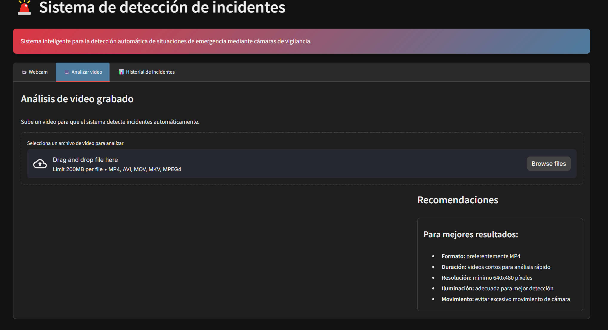 |

- **Registro histórico:** Seguimiento de incidentes detectados con estadísticas y filtros.

  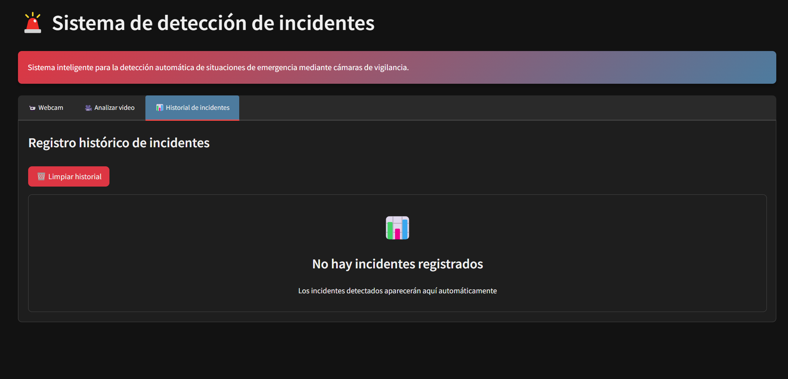

### 2. Chatbot Asistencial:


Características:
- **Interfaz conversacional:** Diseño intuitivo tipo chat.
- **Respuestas contextuales:** Mantiene el hilo de la conversación.
- **Adaptación a consultas complejas:** Capaz de entender y responder a preguntas elaboradas sobre emergencias.

### 3. Agente de Aprendizaje:


Características:
- **Procesamiento de videos:** Análisis de contenido educativo de YouTube.
- **Generación de materiales:** Creación automática de resúmenes y cuestionarios.
- **Descarga de recursos:** Exportación de materiales en formato PDF.
- **Asistente personalizado:** Chatbot específico para cada video analizado.

### Aspectos técnicos:

La aplicación web se desarrolló siguiendo principios de:
- **Diseño responsivo:** Adaptable a diferentes dispositivos y tamaños de pantalla.
- **Interfaz oscura:** Diseño visual coherente optimizado para uso prolongado.
- **Navegación simple:** Sistema de pestañas y botones intuitivos.
- **Feedback visual:** Indicadores de progreso y notificaciones claras.

La implementación utiliza componentes avanzados de Streamlit:
- **Webrtc:** Para procesamiento de video en tiempo real
- **Sesiones persistentes:** Para mantener el estado entre interacciones
- **Componentes interactivos:** Para una experiencia de usuario fluida

---

## 9. Conclusiones

El desarrollo de _AsistencIA_ representa un avance significativo en la aplicación de técnicas de Inteligencia Artificial para mejorar la seguridad ciudadana y la respuesta ante emergencias. Destacamos los siguientes logros y aprendizajes:

### Logros técnicos:

1. **Sistema de detección multimodal:** Integración exitosa de tres modelos de detección especializados en una única plataforma.
2. **Arquitectura unificada:** Desarrollo de una infraestructura que coordina diferentes tecnologías de IA (visión por computador y NLP).
3. **Rendimiento en tiempo real:** Optimización de modelos para funcionar eficientemente incluso en hardware limitado.
4. **Experiencia de usuario intuitiva:** Interfaz accesible que facilita el uso por parte de personal no especializado.

### Impacto potencial:

1. **Seguridad pública:** El sistema puede contribuir significativamente a la detección temprana de situaciones de riesgo.
2. **Capacitación ciudadana:** Las herramientas de aprendizaje permiten mejorar la preparación ante emergencias.
3. **Asistencia inmediata:** El chatbot proporciona información crucial en momentos críticos cuando no hay profesionales disponibles.

### Limitaciones y trabajo futuro:

1. **Mejora continua de modelos:** Sería beneficioso ampliar los datasets y refinar los modelos para mejorar la precisión en condiciones complejas.
2. **Integración con sistemas de emergencia:** Conectar directamente con servicios oficiales de emergencia para una respuesta más rápida.
3. **Ampliación de tipos de emergencias:** Incorporar detección de otros incidentes como inundaciones, caídas de personas mayores, etc.
4. **Expansión del conocimiento del chatbot:** Aumentar la base de conocimientos con protocolos adicionales y recomendaciones específicas por región.
5. **Implementación en dispositivos móviles:** Desarrollar versiones optimizadas para smartphones y dispositivos IoT.

### Consideraciones éticas:

Es importante señalar que un sistema como _AsistencIA_ debe implementarse considerando:
- Privacidad y consentimiento en la monitorización de espacios públicos
- Verificación humana de alertas críticas para evitar falsos positivos
- Acceso equitativo a la tecnología independientemente de recursos económicos
- Transparencia sobre las capacidades y limitaciones del sistema

_AsistencIA_ demuestra el potencial de la IA para crear tecnologías que no solo son técnicamente avanzadas, sino que también tienen un impacto social positivo, contribuyendo a comunidades más seguras y mejor preparadas ante emergencias.

## 10. Integrantes del equipo y porcentaje de contribución

| [](https://github.com/germangarest) | [](https://github.com/DavidMoCe) |
|:---------------------------------------------------------------------------------------------------------:|:-------------------------------------------------------------------------------------------------:|
| **Germán García Estévez**<br>70% contribución                                                               | **David Moreno Cerezo**<br>30% contribución                                                     |

---
